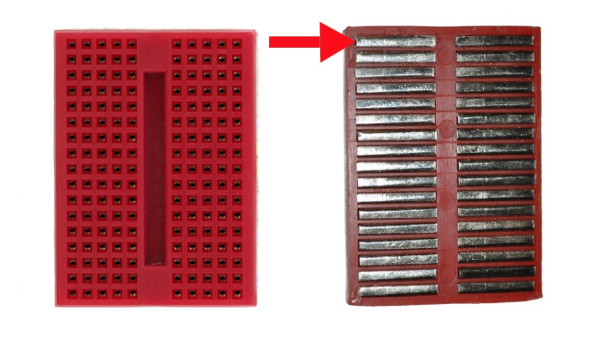
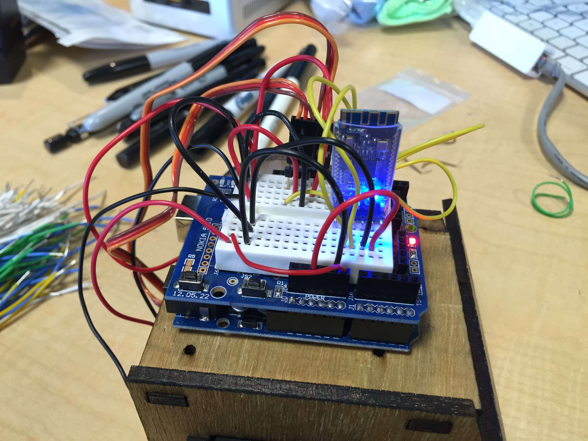

#Sumobot BT

MOST UP-TO-DATE INSTRUCTIONS HERE: https://github.com/make-on-the-lake/sumobot_bt/blob/master/instructions/assembly.md

##Included

* Arduino UNO compatible board
* Arduino prototyping shield
* Breadboard
* Bluetooth LE module (HM-10)
* 2x Continuous Rotation Servos (PowerHD AR-3606HB)
* 3d-printed ball caster
* Metal ball bearing 5/8"
* 4xAA Battery Holder
* 4xAA Batteries
* 9v Battery Holder
* 9v Battery
* Screws 
  * 4x 3/8" #4 wood screws
  * 3x 1/2" #4 wood screws
* 4x Rubber bands (Size 64)
* Laser-cut chassis and wheels
* Breadboarding wire

##Assembly

###Chassis

This will take time to dry, so start here. 

Note that there is a finished and unfinished side to the wood. The sides will have the finished side facing out. The top and bottom will have the finished side facing up, and the plow will have the finished side facing forward.
The top and bottom have arrows which should both be pointing towards the plow.

Place wood glue where the sides meet once assembled. Assemble and hold the parts together with two rubber bands, like so:

Be careful not to get wood glue on the bands as you'll use them for tires later.
This will take about 30-35 mintues to dry, or until clear. Set aside for later.

###Electronics

Plug the prototyping shield into the Arduino like so:

Take care not to force the shield. Ensure that the shield is oriented properly. The breadboard can sit inside the shield. 
The breadboard has an adhesive backing. I recommend leaving this on and using tape or other non-permanent methods to attach the breadboard to the shield.

**A Note About Breadboards:**
Breadboards internally are electrically connected like this:

So plugging things in the same column is the same as connecting them with a wire.

This is a diagram of how the breadboard should be wired:

An image for further reference:

**IMPORTANT**
If you are unsure at all about your wiring, don't plug in the batteries. Find an organizer and we will help double-check the wiring before connecting power.

####Bluetooth

The bluetooth module is based on the HM-10 chip. For more advanced users, [the data sheet is here](http://www.tinyosshop.com/datasheet/Tinysine%20Serial%20Bluetooth4%20user%20manual.pdf)

Each module is configured with a unique name which is written on the bag it comes in. You will use this name to connect to your robot, so don't lose it. If you do, see an organizer to set a new name for your bluetooth module.

###Chassis (Continued)

####Servos

Prepare the servo horns. You have a couple but by default the wheels are cut for these:

Orient the servo horn so that it is on the *unfinished* side of the wheel with the mounting hole facing out:

**IMPORTANT**
Before attaching horn to wheel, place the servo mounting screw through the horn. It will be "trapped" in by the wheel once attached.
From the finished side of the wheel, screw through the wheel into the servo horn. Some force may be required as the screws are larger than the holes in the horns.

Once the wood glue is dry, remove the rubber bands.

Screw the ball caster onto the bottom of the chassis and place the ball bearing in the ball caster:

Your servo comes with rubber isolators that slip over the screw holes. **These are important** as they make enough clearance for the 9v battery. Place them on your servo:

Mount the servos in the sides, ensuring that the servo wires are facing towards the back of the chassis. Screw the servos in. 

**NOTE**
If your woodcut parts came with screws, use these to mount the servos without the brass eyelets. Otherwise, use the screws included with your servos and use the brass eyelets as pictured.

Now that the servos are mounted, attach the wheels. Place a screwdriver through the middle hole of the wheel and turn the captive servo mounting screw into the servo. Take care not to over tighten.

At this point, the hardware should be assembled:

Insert the batteries. The AAs place above the servos and the 9v is placed between the servos:

### Controlling the robot

Download the sumobot app on your phone or tablet. There are iOS, Android, and Windows Phone apps available. Your device must support Bluetooth 4.0. See an organizer if you are unsure about compatibility.

Enter in the robot name that was written on the bag for your bluetooth module.
